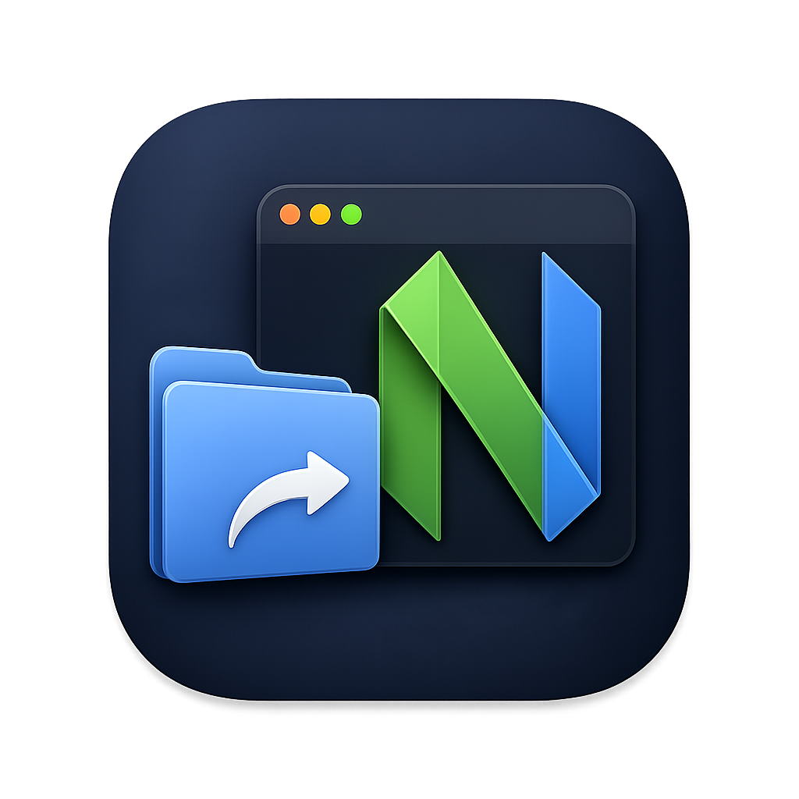

<p align="center">
  
</p>

<h1 align="center">Open In Nvim</h1>

<p align="center">
  Open files and folders in Neovim from Finder context menus, Open With, or default app associations.
</p>

<p align="center">
  English | <a href="README.zh-CN.md">简体中文</a>
</p>

## Overview

Open In Nvim is a macOS app that sends files and folders from Finder to Neovim.

It supports:

- Finder context menu actions
- Finder Quick Actions and Services
- macOS Open With
- Default app associations for selected file extensions

When a connectable nvim instance already exists, files are opened in that instance. Otherwise, the app opens a terminal and starts a new nvim instance.

## Install

Build the DMG:

```sh
make dmg
open "dist/Open In Nvim.dmg"
```

Open the DMG and drag `Open In Nvim.app` into `Applications`.

Installed location:

```text
/Applications/Open In Nvim.app
```

When upgrading from an older version, remove `/Applications/Open In Nvim.app` first, then drag in the new app from the DMG.

## First Setup

Open `/Applications/Open In Nvim.app` directly to show the settings window.

Common settings:

- Language: Automatic, Simplified Chinese, English
- Terminal: Automatic, Ghostty, Alacritty, iTerm2, Terminal.app, or a custom app name
- Existing nvim: how files should open in an existing nvim instance
- nvim plugin: install the bundled lazy.nvim spec into `~/.config/nvim/lua/plugins/open-in-nvim.lua`
- tmux: whether to use tmux when a new nvim instance must be started
- Default extensions: which file extensions should use Open In Nvim as the default app

Default extensions:

```text
ts rs py json css scss less sass c cpp
```

Advanced settings:

- Custom terminal
- nvim path

Settings are managed by the app and stored locally. You usually do not need to edit the config file manually.

## Existing nvim Instances

Open In Nvim can send a file to an already running nvim instance, but only if that instance exposes Neovim's RPC server. A plain `nvim` process does not always expose a discoverable server by default, so an external macOS app may have no reliable way to talk to it.

The bundled nvim plugin solves that setup step. When nvim starts normally, the plugin starts the RPC server if needed and writes a small state file that Open In Nvim can discover.

This means you can keep starting nvim the usual way:

```sh
nvim
```

No manual `nvim --listen ...` command is needed.

Install the plugin from GitHub with lazy.nvim. For example, create `lua/plugins/open-in-nvim.lua`:

```lua
return {
  "pzehrel/open-in-nvim",
  lazy = false,
  config = function(plugin)
    vim.opt.runtimepath:prepend(plugin.dir .. "/nvim-plugin")
    require("open-in-nvim").setup()
  end,
}
```

The app looks for available instances in this order:

```text
~/.local/state/nvim/open-in-nvim/server
Neovim's serverlist() RPC discovery
```

The plugin creates the RPC server with Neovim's `serverstart()` function, so normal `nvim` launches can be reused by the app. Files are then opened through Neovim RPC. The “Existing nvim” setting controls the open mode:

- New tab
- Horizontal split
- Vertical split
- Buffer only

## tmux

tmux only applies when no connectable nvim instance exists and the app needs to start a new one.

Modes:

- Off: start nvim directly in the terminal
- Automatic: use tmux when `tmux` is available
- Always: require tmux and show an error if it is unavailable

`tmux session` is empty by default. When empty, each new nvim launch creates a new tmux session. When a session name is set, the app opens a new window in that session if it exists, or creates the session if it does not.

## Finder Entry

The app includes a Finder Sync Extension. When enabled, Finder can show “Open in nvim” directly in the context menu for monitored folders.

Default monitored locations:

- Home directory `~/`
- External volumes `/Volumes`

If the Finder context menu does not appear immediately, enable the Finder extension in System Settings:

```text
Privacy & Security -> Extensions -> Finder Extensions -> Open In Nvim Finder Extension
```

If the Services menu does not appear immediately, log out and back in, or check:

```text
Keyboard -> Keyboard Shortcuts -> Services / Quick Actions
```

macOS applies system-level limits to Finder Sync Extensions. If the direct context menu is unavailable in some location, use Quick Actions or Services as a fallback.
